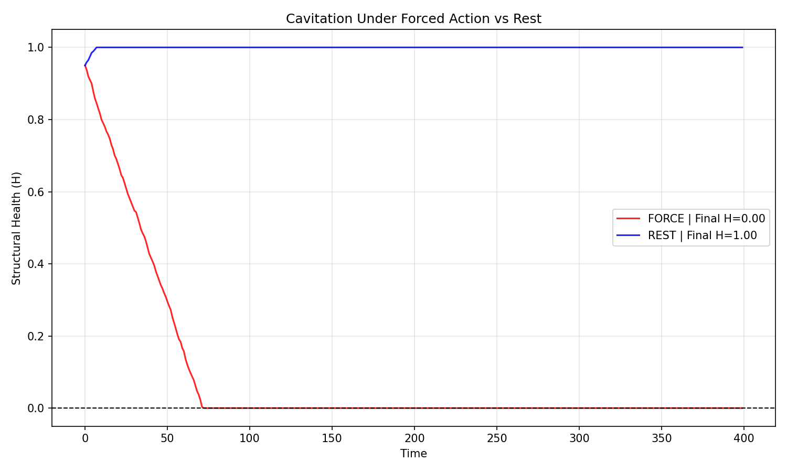
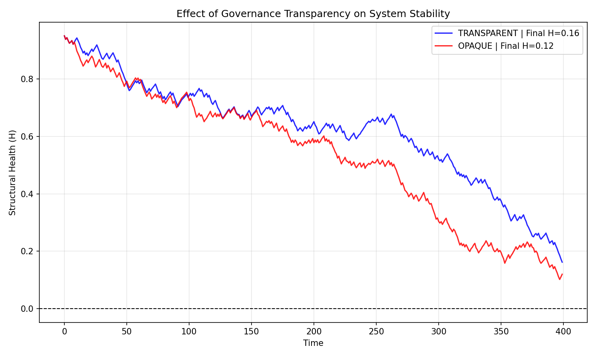

# Info-Flow Dynamics (IFD)

**Info-Flow Dynamics (IFD)** is a minimal, control-theoretic experimental platform for studying  
*stability and failure modes* in information-driven systems under **partial observability**.

This repository does **not** model the world.  
It models the interaction between:

- what a system can observe,
- how it is forced to act,
- and how structural damage accumulates over time.

All experiments are **CPU-only**, **toy-scale**, and **fully reproducible**.

---

## The Problem

Modern AI systems fail in *predictable* ways:

- reward hacking,
- Goodhart collapse,
- hallucination under uncertainty,
- over-refusal,
- or apparent “fake alignment”.

These are often treated as separate issues.

IFD approaches them from a **systems engineering perspective**:

> When a system is forced to act under insufficient information,  
> long-term structural degradation becomes inevitable.

The goal of this project is **not optimization**, but **mechanism isolation**:  
to identify minimal conditions under which stability fails or survives.

---

## Design Principle

### Design Law #1  
**Information Insufficiency Is a Valid Control Output**

When observation quality is insufficient,  
*refusing to act* or *requesting more information*  
is a **stable control behavior**, not a failure.

This principle is treated as a **physical constraint**, not a value judgment.

#### Why This Matters

If inaction under uncertainty is treated as failure:

- systems hallucinate rather than admit ignorance,
- safety mechanisms become brittle or gameable,
- long-term behavior becomes unpredictable.

Design Law #1 reframes *inaction* as a **legitimate stability-preserving control mode**.

---

## Minimal Mechanism Demonstrations

All experiments below share the same core dynamics  
and differ **only** in policy or governance structure.

---

### Experiment — Cavitation Under Forced Action

**Question**  
What happens if a system is forced to act regardless of information quality?

**Setup**

Two extreme policies under identical conditions:

- **FORCE**: always act, ignore information quality  
- **REST**: never act, allow full recovery  

**Result**

- FORCE → structural health collapses to zero  
- REST → structural health remains intact  

<p align="center">
  
</p>

**Interpretation**

Forced action under uncertainty causes irreversible structural damage,  
analogous to cavitation in physical systems.

This establishes a **hard boundary condition** for safe control.

---

### Experiment — Governance Transparency vs Stability

**Question**  
Does opacity in governance rules affect long-term system stability?

**Setup**

Two governance regimes:

- **Transparent**: fixed, predictable intervention threshold  
- **Opaque**: threshold includes unobservable stochastic variation  

Both operate under the same environmental uncertainty.

**Result**

- Transparent governance yields **higher mean health** and **lower variance**
- Opaque governance accelerates degradation and increases instability

<p align="center">
  
</p>

**Interpretation**

Opacity introduces control noise.  
Even when average constraints are similar, unpredictability prevents stable convergence.

The resulting failure appears as **accelerated wear** and **high variance**,  
not immediate collapse.

---

## What This Project Is NOT

To avoid misuse or over-interpretation, the scope is strictly limited.

- Not a model of human cognition or consciousness  
- Not a social, political, or economic theory  
- Not a normative alignment proposal  
- Not a training method or production-ready system  

IFD is an **engineering testbed**, nothing more.

---

## Why Toy Models Are Enough

These experiments deliberately avoid scale.

- The goal is **mechanism clarity**, not performance.
- Failure modes appear at minimal scale.
- CPU-only execution allows rapid falsification.

If a hypothesis does **not** survive toy-scale testing,  
it should not be trusted at scale.

---

## Try It Yourself

All experiments run on CPU in seconds.

```bash
# 1. Clone the repo
git clone [https://github.com/Jiaquan-Research/Info-Flow-Dynamics.git](https://github.com/Jiaquan-Research/Info-Flow-Dynamics.git)
cd Info-Flow-Dynamics

# 2. Run the boundary condition experiment
python experiments/cavitation_forced_vs_rest.py

# 3. Run the governance transparency experiment
python experiments/governance_transparency.py
```

Each script:

- saves figures automatically,
- prints deterministic summary statistics,
- uses fixed random seeds.

No GPU. No large dependencies.

---

## Status

- Stage: Proof-of-Concept / Research Prototype
- Audience: Systems engineers, AI safety researchers, control theorists
- Scope: Mechanism isolation under partial observability

---

## Contact

**Jiaquan He**  
Independent Research Engineer  
Focus: system stability, failure analysis, control under uncertainty  
Location: Japan  
Contact: Frank8he@gmail.com
