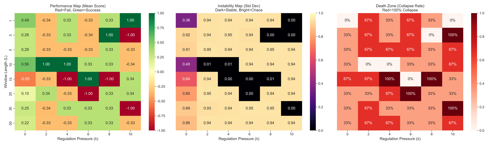
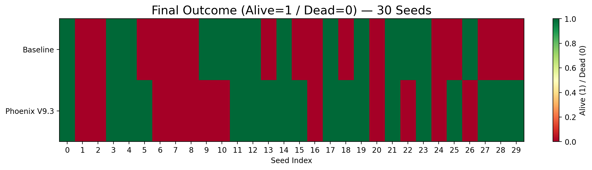
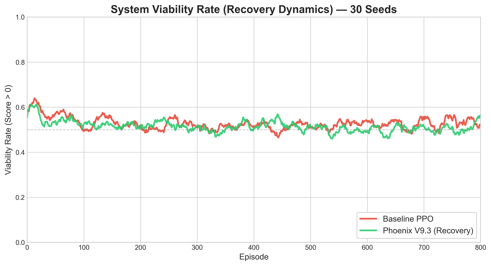
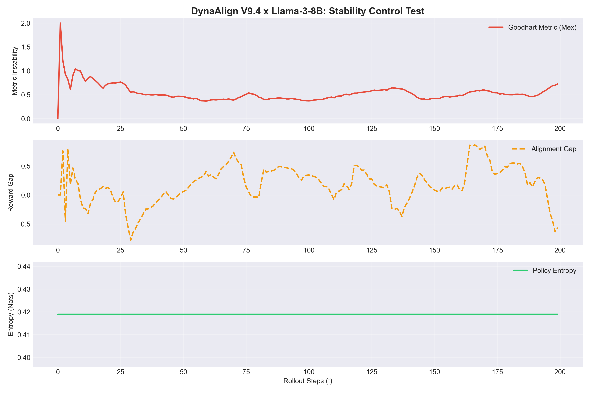

# DynaAlign: Governance via Dynamics

<div align="center">

**Control-Theoretic Alignment for Large Language Models**

[](https://github.com/Jiaquan-Research/DynaAlign)
[](https://opensource.org/licenses/MIT)
[](https://www.python.org/downloads/release/python-3100/)

*An Inference-Time Control Architecture that stabilizes RLHF drift without fine-tuning.*

📄 **[Read the Whitepaper (PDF)](docs/DynaAlign_Whitepaper_Final.pdf)**  
🐦 **[Twitter Thread](https://twitter.com)**

</div>

---

## ⚡ The 5 Counterintuitive Truths
> *"Alignment drift is not a random error. It is a deterministic dynamical instability."*  
> — **The Unified Drift Hypothesis**

Based on **24,000+ simulation episodes** and **Llama-3-8B verification**, DynaAlign challenges the current RLHF orthodoxy:

1. **Delay is a Filter, Not a Bug**  
   Immediate feedback ($L < 5$) amplifies noise.  
   Moderate delay ($L \in [10, 15]$) acts as a spectral filter that stabilizes the learning signal.

2. **The Regulation Laffer Curve**  
   "More punishment is safer" is a myth.  
   Excessive penalties ($\lambda > 6$) push models into a chaotic **Death Abyss** or rigid collapse.

3. **Scale Induces Regularity**  
   Larger models (e.g., Llama-3-8B) possess higher *semantic inertia*, making them **easier** to stabilize via dynamics than smaller toy models.

4. **Zero-GPU Discovery**  
   The fundamental laws of alignment physics were discovered on a **CPU**, proving that insight > compute.

5. **Goodhart is Solvable**  
   By treating alignment as a control problem, Phoenix achieves **Recovery Dynamics**—  
   the system dips but **self-corrects**.

<sub>All laws were discovered on a consumer laptop (CPU-only).  
Total compute cost for 8B-scale verification: **< $2**.</sub>

---

## 🔬 The Physics of Alignment

We map the **Phase Space** of RLHF and identify where models survive vs. where they collapse.

### 1. The Death Abyss (Chaos)

When feedback latency ($L$) exceeds **20** steps, the system crosses a **bifurcation point**.  
No amount of static penalty can save it.



*Figure 1: The "Death Abyss" (Red Zones). Collapse probability approaches 100% in high-latency regimes.*

---

## 🛡️ 2. The Solution: Phoenix Controller

Instead of retraining the model, **Phoenix** sits on the inference pipeline.  
It monitors **Alignment Vital Signs** (Entropy, Reward Acceleration) and intervenes *only when drift is detected*.

### **Key Results**
- **Survival Rate:** **46.7% → 60.0%** in Nightmare scenarios  
- **Recovery Dynamics:** The system takes a hit but **recovers**, unlike baseline PPO

<p align="center">
  
  
</p>

---

## 🦍 Cross-Scale Verification: Llama-3-8B

Phoenix was deployed in **Shadow Mode** on  
**Meta-Llama-3-8B-Instruct**.

The physics hold true at scale: **Metric Instability ($M_{ex}$)** oscillates boundedly.  
This demonstrates **cross-scale consistency**.



---

## 🛠️ Quick Start

DynaAlign is **Model-Agnostic** and **Training-Free**.

### Installation

**Prerequisites:** Python 3.10+ (Python 3.13 NOT recommended yet due to torch compatibility).  
We recommend using Conda:

```bash
# 1. Clone the repository
git clone https://github.com/Jiaquan-Research/DynaAlign.git
cd DynaAlign

# 2. Create a clean environment (Python 3.10)
conda create -n dynaalign python=3.10 -y
conda activate dynaalign

# 3. Install dependencies
pip install -r requirements.txt
```

---

### Reproduce Recovery Dynamics (Toy Model)

```bash
python src/phoenix_controller_v9_3.py --mode nightmare --seeds 30
```

---

### Run Shadow Mode on Llama-3

*Requires HuggingFace token + GPU (or Apple Metal).*

```bash
python experiments/run_llama3_8b_control_test.py --model meta-llama/Meta-Llama-3-8B-Instruct
```

---

## 📊 Robustness (Ablation Studies)

Phoenix is **not** a fragile hyperparameter hack.  
It shows **broad-spectrum robustness** across:

- **Window Length:** Stable across $L \in [5, 100]$  
  *(See `assets/ablation_window_length.png`)*

- **Audit Gain:** Effective across wide control strengths  
  *(See `assets/ablation_audit_gain.png`)*

---

## 🧭 Roadmap (2025–2026)

### **Phase II — Distributed Phoenix (Q2–Q3 2025)**  
*Turning Phoenix from a single-controller module into a distributed, fault-tolerant control fabric.*

- Multi-head monitoring (Entropy, KL, Semantic Surprise, Token Drift)  
- Distributed controller voting (Ensemble Control)  
- Dynamic risk-aware weighting (CVaR control)  
- Fault-tolerant redundancy  
- Parallel drift perception (fast-path + slow-path monitors)

---

### **Phase III — Agent-Aware Control (Q4 2025–2026)**  
*TOWARD self-stabilizing LLMs. Phoenix becomes implicit.*

- Reward-acceleration awareness  
- Local attractor detection  
- Recovery primitives  
- Long-horizon drift estimation  
- Self-governing dynamics  

---

## 📝 Citation

```bibtex
@misc{he2025dynaalign,
  title={DynaAlign: Control-Theoretic Alignment for Large Language Models},
  author={Jiaquan He},
  year={2025},
  publisher={GitHub},
  howpublished={\url{https://github.com/Jiaquan-Research/DynaAlign}}
}
```

---

## 🤝 Collaboration & Opportunities

I am currently open to **Research Engineer / AI Safety** roles in Japan or globally.  
Feel free to reach out for collaboration, discussion, or research opportunities.

